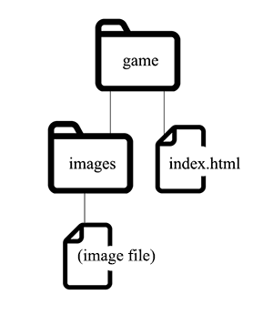

# Exercise: Links 

Here's a new week's worth of exercises!   We're picking up from last week's exercises, so start from Dig Dug wherever you left off last time.

## Do the following:

1. Create the following file structure and put your **index.html** page in the top folder.  Put the image into the appropriate subfolder (aka subdirectory) and preview.

    

1. Fix the link to the image so that it works.

1. Create a simple new separate page that contains only a large image of the game (call the file **pic1.html**).  (ok if huge for now, but include alt text).
    - No specific image... Just Google "Dig Dug" for an image to use.

1. Put it (the new html file) in a new subfolder of **game** (maybe called "big").
(make sure the large image is still in the images folder, and the path in the `src` attribute still connects to it).

1. Link from the **index.html** to the big image page (pic1.html).

1. Link from the big image page back to the **index.html** (make a new text link if you need to).

1. Add an additional link (from the image page) to the source info area on the index page by adding a fragment name (you made one at the end of last exercise) to the URL of the index page.
    - Remember how to do this?  Think back to the Octothorpe!

1. On the index.html, make an external link to the page on MobyGames about Dig Dug.

1. Change that link so that it creates a new window when clicked.  (probably bad practice, but we still want you to see how it's done).

## If you are so inclined and want to impress:

- Add a "thumbnail" version of the big image to the index.html so that when it's clicked on, it goes to the big image page. 
- Add additional big images that represent the game.

## Continue on to the next exercise. 

